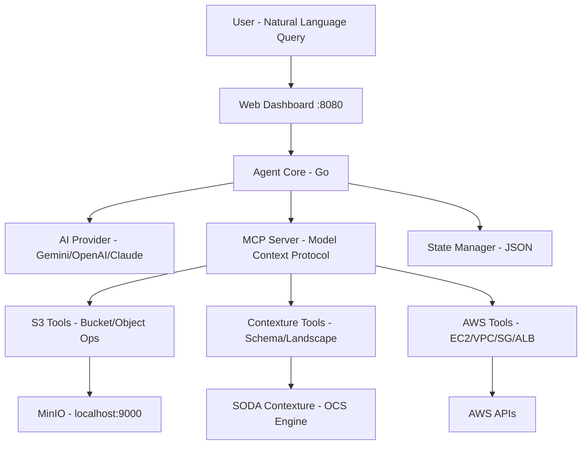
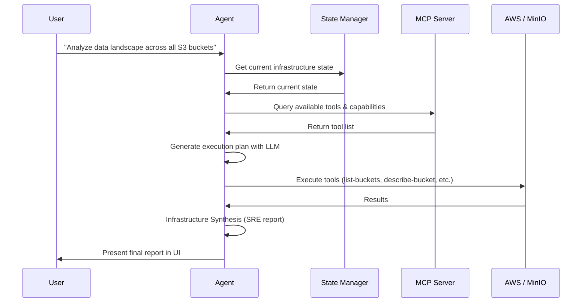

# S3-SODA-Contexture

<h1 align="center" style="border-bottom: none">
  
</h1>

<div align="center">

[](https://golang.org/)
[](https://aws.amazon.com/)
[](https://modelcontextprotocol.io/)
[](https://sodafoundation.io/)

*Intelligent AWS infrastructure and S3 storage management through natural language, powered by SODA Contexture*

</div>

---

## What is S3-SODA-Contexture?

S3-SODA-Contexture is an intelligent infrastructure management system that integrates S3/MinIO storage capabilities with the [SODA Contexture](https://github.com/sodafoundation/contexture) open context engine. It allows you to manage AWS infrastructure and S3-compatible storage backends using natural language commands.

Powered by AI models (Google Gemini, OpenAI GPT, Anthropic Claude, or local Ollama), it translates your requests into executable operations while maintaining safety through conflict detection and dry-run mode.

### Key Features

- **Natural Language Interface** — Describe what you want, not how to build it
- **S3/MinIO Storage Integration** — Full S3-compatible storage management via SODA Contexture
- **SODA Contexture Engine** — Enriched operational context (OCS) for accurate AI-driven decisions
- **Multi-AI Provider Support** — OpenAI, Google Gemini, Anthropic, AWS Bedrock Nova, or Ollama
- **Web Dashboard** — Visual interface with built-in conflict detection and dry-run mode
- **MCP Protocol** — Model Context Protocol server with 15+ observability tools
- **Infrastructure Synthesis** — AI-generated SRE summary reports after every task
- **Smart Context Capping** — Handles large infrastructures (100+ resources) within API token limits

---

## Architecture

<h1 align="center" style="border-bottom: none">
  
</h1>



### Components

| Component | Description |
|-----------|-------------|
| **Web Interface** | React dashboard for visual interaction (port 8080) |
| **Agent Core** | AI-powered planning, execution, and ReAct recovery loop |
| **MCP Server** | Model Context Protocol with S3, Contexture, and AWS tools |
| **SODA Contexture Engine** | OCS-based context builder for enriched AI reasoning |
| **S3/MinIO Client** | S3-compatible storage operations (buckets, objects, schema) |
| **AWS Client** | EC2, VPC, Security Groups, ALB, Autoscaling via AWS SDK |
| **State Manager** | Terraform-like infrastructure state tracking |

---

## Project Structure

```
S3-SODA-Contexture/
├── cmd/                      # CLI entry points
├── config.yaml               # Main configuration
├── pkg/
│   ├── agent/                # AI agent core (planning, execution, recovery)
│   ├── api/                  # HTTP handlers, WebSocket, server
│   ├── aws/                  # AWS SDK client + S3 operations
│   ├── contexture/           # SODA Contexture integration
│   │   ├── context_builder.go   # OCS context builder for S3 data
│   │   └── ocs_types.go         # Open Context Specification types
│   ├── discovery/            # Infrastructure scanner
│   ├── tools/                # MCP tool implementations
│   │   ├── factory.go           # Tool registry and factory
│   │   ├── s3_tools.go          # S3 bucket/object tools
│   │   └── contexture_tools.go  # Data landscape & schema tools
│   └── types/                # Shared types (MCP definitions)
├── settings/                 # Resource patterns, field mappings, prompt templates
├── scripts/                  # Run and install scripts
├── states/                   # Infrastructure state (auto-generated)
└── web/                      # React web dashboard (pre-built)
```

---

## Prerequisites

| Requirement | Version | Purpose |
|-------------|---------|---------|
| **Go** | 1.24+ | Build and run the agent |
| **MinIO** | Latest | Local S3-compatible storage backend |
| **AI API Key** | — | One of: Gemini, OpenAI, Anthropic, or Ollama |
| **AWS Credentials** | — | For AWS resource management (optional for S3-only) |

---

## Complete Setup & Run Guide

### Step 1: Clone the Repository

```bash
git clone https://github.com/Venksaiabhishek/S3-SODA-Contexture.git
cd S3-SODA-Contexture
```

### Step 2: Set Environment Variables

```bash
# AI Provider (choose one)
export GEMINI_API_KEY="your-gemini-api-key"
# export OPENAI_API_KEY="your-openai-api-key"
# export ANTHROPIC_API_KEY="your-anthropic-api-key"

# MinIO / S3 Credentials
export AWS_ACCESS_KEY_ID="minioadmin"
export AWS_SECRET_ACCESS_KEY="minioadmin"
export AWS_REGION="us-west-2"

# Go path (if not already in PATH)
# export PATH="/usr/local/go/bin:$PATH"
```

### Step 3: Edit Configuration

Edit `config.yaml` to set your AI provider and model:

```yaml
server:
  port: 3000
  host: "localhost"

aws:
  region: "us-west-2"

agent:
  provider: "gemini"              # Options: gemini, openai, anthropic, bedrock, ollama
  model: "gemini-flash-latest"    # Model to use
  max_tokens: 8192
  temperature: 0.0
  dry_run: false                  # Set true for safe testing
  auto_resolve_conflicts: false
  enable_debug: true

web:
  port: 8080
  host: "localhost"
```

### Step 4: Start MinIO

Ensure your local MinIO instance is running on port 9000:

```bash
# Start MinIO server
MINIO_ROOT_USER=minioadmin MINIO_ROOT_PASSWORD=minioadmin \
  minio server /tmp/minio-data --console-address ":9001"
```

Verify it's running:
```bash
curl -s -o /dev/null -w "%{http_code}" http://localhost:9000/minio/health/live
# Should return: 200
```

| Endpoint | URL |
|----------|-----|
| MinIO API | http://localhost:9000 |
| MinIO Console | http://localhost:9001 |

### Step 5: Launch the Application

```bash
./scripts/run-web-ui.sh
```

### Step 6: Access the Web UI

Open your browser to: **http://localhost:8080**

---

## Using the Web UI

### Execution Plan (Transparency)
Before any action is taken, the AI presents a decision plan. You can review exactly what tools (e.g., `describe-bucket`, `analyze-data-landscape`) the AI will use before approving.

### Live Terminal Logs (Observability)
Real-time feed of API interactions provides a "black box" recording for debugging. You can see raw JSON data returned from MinIO.

### Infrastructure State Tab (Discovered Assets)
A visual dashboard of all resources the AI currently knows about — S3 buckets, EC2 instances, VPCs, and more.

### Infrastructure Synthesis (Final Report)
Found at the bottom of the execution plan, this step provides a human-readable SRE summary (e.g., *"I've analyzed bucket-a; it contains 105MB of data across 3 objects."*).

> **Tip**: To see a full execution plan, uncheck **"Dry Run Mode"** in the UI settings before clicking "Process Request".

---

## Usage Examples

```bash
# S3 storage analysis
"Analyze the data landscape across all S3 buckets"

# Bucket operations
"List all buckets and show their sizes"

# Infrastructure creation
"Create a t3.micro EC2 instance with Ubuntu 22.04"

# Web server setup
"Deploy a load-balanced web application with 2 EC2 instances behind an ALB"

# Full environment
"Set up a development environment with VPC, subnets, EC2, and RDS"
```

### How It Works



---

## Safety Features

| Feature | Description |
|---------|-------------|
| **Dry Run Mode** | Preview what would be created/modified/deleted before execution |
| **State Management** | Terraform-like state tracking with drift detection |
| **Smart Context Capping** | Limits AI prompt to 40 tools and 30 resources max (~10k tokens) |
| **Conflict Detection** | Detects and flags resource conflicts before execution |
| **ReAct Recovery** | Automatic retry and recovery loop for failed operations |

---

## Troubleshooting

<details>
<summary><strong>MinIO Connection Refused (port 9000)</strong></summary>

```bash
# Check if MinIO is running
lsof -i :9000

# Start MinIO if not running
MINIO_ROOT_USER=minioadmin MINIO_ROOT_PASSWORD=minioadmin \
  minio server /tmp/minio-data --console-address ":9001"
```
</details>

<details>
<summary><strong>AWS Authentication Issues</strong></summary>

```bash
# Check AWS credentials
aws sts get-caller-identity

# Verify permissions
aws iam get-user
```
</details>

<details>
<summary><strong>AI Provider Issues / 429 Quota Exceeded</strong></summary>

The smart context capping mechanism limits token usage to ~10k per request. If you still hit quota limits:

```yaml
# In config.yaml, try reducing max_tokens:
agent:
  max_tokens: 4096
```

Or switch to a local model:
```yaml
agent:
  provider: "ollama"
  model: "qwen2.5-coder:7b"
```
</details>

<details>
<summary><strong>Decision validation failed: confidence too low</strong></summary>

Increase max_tokens in `config.yaml`:

```yaml
agent:
  max_tokens: 10000
```
</details>

<details>
<summary><strong>Port Already in Use</strong></summary>

```bash
lsof -i :8080
kill -9 <pid>
```
</details>

<details>
<summary><strong>Go Build Issues</strong></summary>

```bash
go clean -modcache
go mod download
go mod tidy
go build ./...
```
</details>

---

## Security Considerations

- **API Keys** — Never commit API keys to version control
- **MinIO Credentials** — Change default `minioadmin` credentials in production
- **AWS Permissions** — Use least-privilege IAM policies
- **Dry Run** — Always test in dry-run mode first
- **Network Security** — Run in private networks when possible

---

## Contributing

1. Create a feature branch: `git checkout -b feature-name`
2. Make your changes and test
3. Commit: `git commit -m "Add feature"`
4. Push: `git push origin feature-name`
5. Create a Pull Request

---

<div align="center">

**Built with ❤️ using SODA Contexture**

*Empowering infrastructure management through AI and enriched context*

[⭐ Star this repo](https://github.com/Venksaiabhishek/S3-SODA-Contexture) | [🐛 Report Bug](https://github.com/Venksaiabhishek/S3-SODA-Contexture/issues) | [💡 Request Feature](https://github.com/Venksaiabhishek/S3-SODA-Contexture/issues)

</div>
