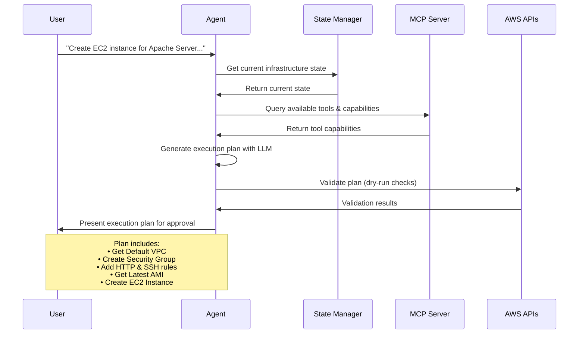

# S3-SODA-Contexture

> ⚠️ **Proof of Concept Project**: This repository contains a proof-of-concept implementation of an AI-powered infrastructure management system with S3/MinIO storage integration, built on the SODA Contexture framework. It is currently in active development and **not intended for production use**. Use at your own risk and always test in development environments first.

<h1 align="center" style="border-bottom: none">
  
</h1>

<div align="center">

[](https://golang.org/)
[](https://aws.amazon.com/)
[](https://modelcontextprotocol.io/)
[](https://sodafoundation.io/)

*Intelligent AWS infrastructure and S3 storage management through natural language interactions, powered by SODA Contexture*

</div>

## What is S3-SODA-Contexture?

S3-SODA-Contexture is an intelligent infrastructure management system that integrates S3/MinIO storage capabilities with the SODA Contexture open context engine. It allows you to manage AWS infrastructure and S3-compatible storage backends using natural language commands. Powered by advanced AI models (OpenAI GPT, Google Gemini, or Anthropic Claude), it translates your infrastructure requests into executable operations while maintaining safety through conflict detection and resolution.

<h1 align="center" style="border-bottom: none">
  
</h1>

### Key Features

- **Natural Language Interface** - Describe what you want, not how to build it
- **S3/MinIO Storage Integration** - Full S3-compatible storage management via SODA Contexture
- **Multi-AI Provider Support** - Choose between OpenAI, Google Gemini, Anthropic, AWS Bedrock Nova, or Ollama (local LLM)
- **Web Dashboard** - Visual interface for infrastructure management, built-in conflict detection and dry-run mode
- **SODA Contexture Engine** - Enriched operational context for accurate AI-driven decisions
- **MCP Protocol** - Model Context Protocol server with 15+ observability tools
- **Terraform-like state** - Maintains accurate infrastructure state

## Example Usage

Imagine you want to create AWS infrastructure with a simple request:

> **"Create an EC2 instance for hosting an Apache Server with a dedicated security group that allows inbound HTTP (port 80) and SSH (port 22) traffic."**

> 💡 **Amazon Nova Users**: When using AWS Bedrock Nova models, you may want to specify the region in your request for better context, e.g., *"Create an EC2 instance in us-east-1 for hosting an Apache Server..."*

Here's what happens:

### 1. AI Analysis & Planning

The AI agent analyzes your request and creates a detailed execution plan:



The agent presents the plan for your review:
- Shows exactly what will be created
- Waits for your approval

<h1 align="center" style="border-bottom: none">
  
</h1>

### 2. Execution & Monitoring

Once approved, the agent:
- Creates resources in the correct order
- Monitors progress in real-time
- Handles dependencies automatically
- Reports completion status

### 3. S3 Storage Operations

The Contexture integration enables S3 storage management:
- **Bucket Management** - Create, list, and manage S3/MinIO buckets
- **Data Landscape Analysis** - Scan and analyze storage topology
- **Object Operations** - Upload, download, and manage objects
- **Schema Detection** - Automatic data schema discovery

## How To Run

### Prerequisites

- **Go 1.24+**
- **MinIO** (local S3-compatible storage)
- **Python 3.9+** (for MCP server and Contexture engine)
- **MongoDB** (for topology storage)

### Clone the repository

```bash
git clone https://github.com/Venksaiabhishek/S3-SODA-Contexture.git
cd S3-SODA-Contexture
```

### 1. Edit Configuration File

```bash
# Edit the main configuration
nano config.yaml
```

### 2. Set Your AI Provider

Choose your preferred AI provider in `config.yaml`:

```yaml
agent:
  provider: "openai"          # Options: openai, gemini, anthropic, bedrock, ollama
  model: "gpt-4"             # Model to use
  max_tokens: 4000
  temperature: 0.1
  dry_run: true              # Start with dry-run enabled
  auto_resolve_conflicts: false
```

### 3. Set Environment Variables

```bash
# For OpenAI
export OPENAI_API_KEY="your-openai-api-key"

# For Google Gemini
export GEMINI_API_KEY="your-gemini-api-key"

# For Anthropic Claude
export ANTHROPIC_API_KEY="your-anthropic-api-key"

# For Ollama (optional - defaults to http://localhost:11434)
export OLLAMA_SERVER_URL="http://localhost:11434"

# For AWS Bedrock Nova - use AWS credentials (no API key needed)
# Configure AWS credentials using: aws configure, environment variables, or IAM roles
```

### 4. Configure AWS Credentials

```bash
# Configure AWS CLI
aws configure

# Or set environment variables
export AWS_ACCESS_KEY_ID="your-access-key"
export AWS_SECRET_ACCESS_KEY="your-secret-key"
export AWS_DEFAULT_REGION="us-west-2"
```

### 5. Start MinIO (S3 Backend)

```bash
# Start local MinIO server
MINIO_ROOT_USER=minioadmin MINIO_ROOT_PASSWORD=minioadmin \
  minio server /tmp/minio-data --console-address ":9001"
```

MinIO will be accessible at:
- **API**: http://localhost:9000
- **Console**: http://localhost:9001

### 6. Launch the Application

```bash
./scripts/run-web-ui.sh
```

### Access the Dashboard

Open your browser and navigate to:
```
http://localhost:8080
```

## Usage Examples

```bash
# Simple EC2 instance
"Create a t3.micro EC2 instance with Ubuntu 22.04"

# Web server setup
"Deploy a load-balanced web application with 2 EC2 instances behind an ALB"

# S3 storage operations
"Analyze the data landscape across all S3 buckets"

# Complete environment
"Set up a development environment with VPC, subnets, EC2, and RDS"
```

## Architecture

<h1 align="center" style="border-bottom: none">
  
</h1>

### Components

- **Web Interface**: React-based dashboard for visual interaction
- **MCP Server**: Core agent implementing Model Context Protocol
- **Agent Core**: AI-powered decision making and planning
- **SODA Contexture Engine**: Open Context Specification (OCS) for enriched AI context
- **S3/MinIO Client**: S3-compatible storage backend integration
- **AWS Client**: Secure AWS SDK integration
- **State Management**: Infrastructure state tracking and conflict resolution

## Project Structure

```
S3-SODA-Contexture/
├── cmd/                      # CLI entry points
├── config.yaml               # Main configuration
├── pkg/
│   ├── agent/                # AI agent core (planning, execution, recovery)
│   ├── api/                  # HTTP handlers, WebSocket, server
│   ├── aws/                  # AWS SDK client + S3 operations
│   ├── contexture/           # SODA Contexture integration (OCS types, context builder)
│   ├── discovery/            # Infrastructure scanner
│   ├── tools/                # MCP tools (S3, Contexture, factory)
│   └── types/                # Shared types
├── settings/                 # Resource patterns, field mappings, prompt templates
├── scripts/                  # Run and install scripts
└── web/                      # React web dashboard
```

## Safety Features

### Dry Run Mode
All operations can be run in "dry-run" mode first:
- Shows exactly what would be created/modified/deleted
- Estimates costs before execution
- No actual AWS resources are touched

### State Management
- Maintains accurate infrastructure state
- Detects drift from expected configuration

## Troubleshooting

### Common Issues

<details>
<summary><strong>MinIO Connection Refused (port 9000)</strong></summary>

```bash
# Check if MinIO is running
lsof -i :9000

# Start MinIO if not running
MINIO_ROOT_USER=minioadmin MINIO_ROOT_PASSWORD=minioadmin \
  minio server /tmp/minio-data --console-address ":9001"
```

</details>

<details>
<summary><strong>AWS Authentication Issues</strong></summary>

```bash
# Check AWS credentials
aws sts get-caller-identity

# Verify permissions
aws iam get-user

# Test basic AWS access
aws ec2 describe-regions
```

</details>

<details>
<summary><strong>AI Provider API Issues</strong></summary>

```bash
# Check API key is set
echo $OPENAI_API_KEY

# Test API connection
curl -H "Authorization: Bearer $OPENAI_API_KEY" \
     https://api.openai.com/v1/models
```

</details>

<details>
<summary><strong>Port Already in Use</strong></summary>

```bash
# Check what's using the port
lsof -i :8080
lsof -i :3000

# Kill processes if needed
kill -9 <pid>

# Or change ports in config.yaml
```

</details>

<details>
<summary><strong>Go Build Issues</strong></summary>

```bash
# Clean module cache
go clean -modcache

# Re-download dependencies
go mod download
go mod tidy

# Rebuild
go build ./...
```

</details>

<details>
<summary><strong>Decision validation failed: decision confidence too low: 0.000000</strong></summary>

Try increase max_tokens:

```yaml
agent:
  provider: "gemini"              # Use Google AI (Gemini)
  model: "gemini-2.5-flash-lite"
  max_tokens: 10000 # <-- increase
```

</details>

## Security Considerations

- **API Keys**: Never commit API keys to version control
- **AWS Permissions**: Use least-privilege IAM policies
- **MinIO Credentials**: Change default minioadmin credentials in production
- **Network Security**: Run in private networks when possible
- **Audit Logging**: Enable comprehensive logging for compliance
- **Dry Run**: Always test in dry-run mode first

## Contributing

1. Create a feature branch: `git checkout -b feature-name`
2. Make your changes
3. Run tests
4. Commit: `git commit -m "Add feature"`
5. Push: `git push origin feature-name`
6. Create a Pull Request

## 📄 License

This project is licensed under the MIT License - see the [LICENSE](LICENSE) file for details.

## ⚖️ Disclaimer

This is a proof-of-concept project. While we've implemented safety measures like dry-run mode and conflict detection, always:

- Test in development environments first
- Review all generated plans before execution
- Maintain proper AWS IAM permissions
- Monitor costs and resource usage
- Keep backups of critical infrastructure

The authors are not responsible for any costs, data loss, or security issues that may arise from using this software.

---

<div align="center">

**Built with ❤️ using SODA Contexture**

*Empowering infrastructure management through AI and enriched context*

[⭐ Star this repo](https://github.com/Venksaiabhishek/S3-SODA-Contexture) | [🐛 Report Bug](https://github.com/Venksaiabhishek/S3-SODA-Contexture/issues) | [💡 Request Feature](https://github.com/Venksaiabhishek/S3-SODA-Contexture/issues)

</div>
